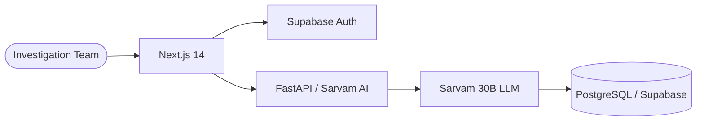

<div align="center">

# Detectra | Enterprise Fraud Intelligence
**Elite sub-second AI engine for insurance investigation units.**

[](https://nextjs.org/)
[](https://fastapi.tiangolo.com/)
[](https://supabase.com/)

</div>

---

## 🏗️ Technical Architecture
Detectra is designed for high-throughput fraud detection, utilizing a modern decoupled stack.



### 📁 Streamlined Repository Structure
```bash
├── frontend/           # Next.js 14 Dashboard & Landing
│   ├── src/app/        # SSR Routes & Interface
│   └── src/components/ # Modular UI Components
├── backend/            # Python FastAPI Service (Sarvam AI)
│   ├── main.py         # AI Logic & TTS Processing
│   └── requirements.txt# Backend Dependencies
└── .env.example        # Centralized Config Manifest
```

---

## 🚀 Getting Started

### Prerequisites
- **Node.js**: 18.0+
- **Python**: 3.9+
- **PIP**: Latest

### Deployment
1. **Clone & Setup**
   ```bash
   git clone https://github.com/pranavgawaii/Detectra.git
   cd Detectra
   npm run install:all
   ```

2. **Environment**
   - Copy root `.env.example` values to `frontend/.env.local` and `sarvam_api/.env`.

3. **Launch**
   ```bash
   npm run dev
   ```

---

## 🔒 Security & Analytics
- **Identity**: Supabase Auth with OAuth 2.0 integration.
- **Privacy**: End-to-end encrypted claim analysis.
- **Analytics**: Real-time fraud scoring powered by Sarvam AI Bulbul V3.

---
<div align="center">
  <strong>Built for the future of insurance. | © 2026 Detectra Technologies</strong>
</div>
